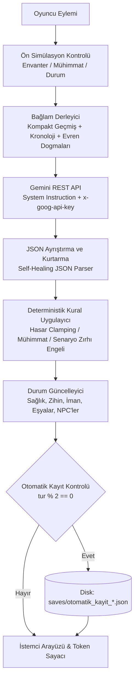

# Chronicles of Gemini

Google Gemini API ve Python tabanlı kural motoru ile çalışan, serbest metin tabanlı RPG ve anlatı simülasyonu motoru.

[](https://www.python.org/)
[](https://flask.palletsprojects.com/)
[](https://ai.google.dev/)
[](test_app.py)
[](LICENSE)

Chronicles of Gemini; çoktan seçmeli sabit seçenekler (A, B, C) yerine oyuncunun serbest metin komutlarını işleyen, kural tabanlı Python simülasyonu ile büyük dil modellerini (LLM) birleştiren bir rol yapma motorudur. Karakter durumu, envanter, sağlık, mühimmat ve evren yasaları deterministik olarak takip edilir; model yanıtları belirlenen kural setleri doğrultusunda denetlenir ve zorunlu fizik/biyoloji sınırlarıyla (post-turn clamping) doğrulanır.

---

## İçindekiler

- [Sistem Mimarisi](#sistem-mimarisi)
- [Oyun Modları ve Kural Sistemi](#oyun-modları-ve-kural-sistemi)
  - [Gerçekçi Mod (Strict Realism)](#gerçekçi-mod-strict-realism)
  - [Fantezi Modu (Consistent Fantasy)](#fantezi-modu-consistent-fantasy)
  - [Tanrı Simülasyonu (God Sim)](#tanrı-simülasyonu-god-sim)
  - [Deli Modu (Nightmare Difficulty)](#deli-modu-nightmare-difficulty)
- [Hafıza ve Anlatı Mimarisi](#hafıza-ve-anlatı-mimarisi)
  - [Çift Katmanlı NPC Takibi](#çift-katmanlı-npc-takibi)
  - [Kronoloji Özeti (Saga Chronicle)](#kronoloji-özeti-saga-chronicle)
  - [Anlatı Formatı ve Diyalog Yapısı](#anlatı-formatı-ve-diyalog-yapısı)
- [Deterministik Kural Uygulayıcı (Rule Enforcer)](#deterministik-kural-uygulayıcı-rule-enforcer)
- [Bağlam ve Token Optimizasyonu](#bağlam-ve-token-optimizasyonu)
- [Durum Yönetimi ve Otomatik Kayıt](#durum-yönetimi-ve-otomatik-kayıt)
- [Oturum Yönetimi ve Çoklu Kullanıcı Desteği](#oturum-yönetimi-ve-çoklu-kullanıcı-desteği)
- [Evren ve Karakter Konsept Üreticisi](#evren-ve-karakter-konsept-üreticisi)
- [GM Konsolu](#gm-konsolu)
- [Hazır Evren Şablonları](#hazır-evren-şablonları)
- [Kurulum ve Çalıştırma](#kurulum-ve-çalıştırma)
- [API Referansı](#api-referansı)
- [Birim Testleri](#birim-testleri)
- [Güvenlik ve Yapılandırma](#güvenlik-ve-yapılandırma)
- [Lisans](#lisans)

---

## Sistem Mimarisi

Sistem; dil modelinin metin üretimini deterministik ön kontrol, çift fazlı kural denetleyicisi ve durum takip motoruyla birleştiren bir boru hattı (pipeline) üzerinde çalışır:



---

## Oyun Modları ve Kural Sistemi

### Gerçekçi Mod (Strict Realism)
- **Fiziksel Kısıtlamalar:** Karakter eylemleri senaryo ayrıcalığı tanınmaksızın değerlendirilir. Yaralanmalar, hastalıklar, açlık ve çevre koşulları doğrudan simülasyona etki eder.
- **Envanter Bağımlılığı:** Oyuncu yalnızca üzerinde bulunan eşyaları kullanabilir. Envanterde olmayan araçlarla kilit açma, silah ateşleme gibi eylemler kural motoru tarafından reddedilir.
- **Deterministik Mühimmat Takibi:** Ateşli silah kullanıldığında mermi tüketimi deterministik Python kodu tarafından hesaplanır ve envanterden düşülür.

### Fantezi Modu (Consistent Fantasy)
- Doğaüstü yetenekler ve büyü mekanikleri serbesttir; ancak evrenin önceden tanımlanmış kuralları, bedel dengeleri ve sınırlılıkları çerçevesinde yürütülür.

### Tanrı Simülasyonu (God Sim)
Oyuncunun tekil bir canlı yerine evrenin kurallarını ve ölümlü toplumları yönettiği simülasyon modudur:
- **Kozmik Metrikler:** İman (Faith), Korku (Fear) ve Kudret (Divine Power) dengesi üzerinden toplumsal etkiler izlenir.
- **Dua Havuzu (Prayers Hub):** Her turda ölümlülerden gelen yakarılar listelenir. Tanrı; lütuf bahşetme, gazap indirme, ironik tecelli ile kaderi bükme veya duayı cevapsız bırakma kararı verebilir.
- **İlahi Fermanlar:** Fizik ve doğa kurallarına doğrudan müdahale eden fermanlar yayınlanabilir.
- **Peygamber ve Elçi Atama:** Ölümlüler arasından temsilciler seçilerek inanç doktrinleri yayılabilir.
- **Medeniyet Çağları:** Toplumlar Kabile döneminden Uzay/Kozmik çağa kadar 7 aşamalı gelişim evresinde ilerletilebilir.
- **Evren Sıfırlama:** Gerektiğinde evren sıfırlanarak yeni bir yaratılış döngüsü başlatılabilir.

### Deli Modu (Nightmare Difficulty)
Karşılaşma zorluklarının ve hasar çarpanlarının en üst seviyeye çıkarıldığı, kaynak kısıtlarının katı uygulandığı moddur. Hatalı hamleler yüksek can ve akıl sağlığı kaybıyla sonuçlanır.

---

## Hafıza ve Anlatı Mimarisi

### Çift Katmanlı NPC Takibi
- **Aktif Sahne Listesi (`npc_relationships`):** Yalnızca o anda mekanda bulunan karakterleri gösterir. Sahneden ayrılan ve 3 tur boyunca etkileşime girilmeyen karakterler arayüz kalabalığını önlemek için aktif listeden çıkarılır.
- **Kalıcı Dünya Hafızası (`known_world_npcs`):** Karşılaşılan önemli karakterler arka planda saklanır. Oyuncu turlar sonra aynı karaktere döndüğünde geçmiş etkileşimler model bağlamına yeniden aktarılır.

### Kronoloji Özeti (Saga Chronicle)
Oyun boyunca yaşanan önemli dönüm noktaları, mekan geçişleri ve kritik kararlar `GameState.generate_saga_chronicle()` tarafından kronolojik bir zaman çizelgesi olarak özetlenir. Bu özet her turda model bağlamına dahil edilerek onlarca tur önceki olayların unutulması engellenir.

### Anlatı Formatı ve Diyalog Yapısı
- **Anlatı Derinliği:** Sistem istemi, edebi zenginliği korumak amacıyla her turda çok paragraflı detaylı tasvirler üretilmesini kurala bağlar.
- **Doğrudan Diyalog:** Karakter konuşmaları `[Karakter Adı]; "Diyalog metni..."` biçiminde yapılandırılarak anlatıcı metninden ayrıştırılır.
- **Geniş Açı ve Mikro Odak:** Özellikle Tanrı Simülasyonunda kararların etkisi hem makro ölçekte hem de sıradan insanların gündelik yaşamındaki yansımalarıyla ele alınır.

---

## Deterministik Kural Uygulayıcı (Rule Enforcer)

Dil modellerinin ürettiği JSON yanıtları salt bir "tavsiye" niteliğinde kalmaz; **`RuleEnforcer.enforce_post_turn`** motoru tarafından deterministik doğrulamaya tabi tutulur:

1. **Mühimmat ve Kuru Tetik Denetimi:** Oyuncu mermisi bitmiş bir silahla ateş etmeye çalıştığında, model aksiyonu başarılı saysa dahi Python çekirdeği araya girer; mühimmatın boş olduğunu doğrular, atışı başarısız kılar ve hakem kararına kuru tetik sonucunu zorunlu olarak işler.
2. **Biyolojik Durum Hasarı Clamping:**
   - **Kanama:** Karakterde kanama varsa, modelin can kaybı vermemesi veya iyileşme üretmesi engellenir. Deli modunda en az `-15`, normal modlarda en az `-5` can kaybı kod seviyesinde garanti edilir.
   - **Zehirlenme:** Deli modunda en az `-20` can kaybı ve `-15` zihinsel hasar zorunlu uygulanır.
   - **Hipotermi:** Soğukta donma şartlarında sağlık ve zihinsel direnç kayıpları taban değerlere kilitlenir.
3. **Senaryo Zırhı ve Karşılıksız İyileşme Engeli:** Oyuncunun envanterinde tıbbi bir malzeme bulunmadığı veya açıkça bir tedavi/dinlenme eylemi gerçekleştirilmediği sürece modelin ürettiği yapay iyileşmeler (`health_delta > 0`) sıfırlanır.
4. **Denetim İzi (Audit Log):** Kural motorunun yaptığı tüm zorunlu müdahaleler `rule_warnings` ve `state_updates.deterministic_enforcements` altına şeffafça kaydedilir.

---

## Bağlam ve Token Optimizasyonu

Uzun süreli oyun oturumlarında geçmiş turların tüm sistem kurallarını tekrarlaması token birikimine ve kota tükenmesine yol açar. Bu sorunu çözmek için aşağıdaki optimizasyon mimarisi uygulanmıştır:

- **`get_compact_history`:** Konuşma geçmişine sistem yönergeleri yinelenmeden yalnızca oyuncu eylemi (`Oyuncu Eylemi: "..."`) ve modelin anlatı metni aktarılır.
- **Pencereli Geçmiş:** Yalnızca son turların diyalogları tam metin tutulur; eski olaylar kronoloji özeti üzerinden aktarılır.
- **Güvenli Çıktı Sınırı:** `max_tokens` değeri 8192 olarak yapılandırılmıştır.
- **Canlı Metrik Takibi:** Arayüzde yer alan token göstergesi her turda harcanan prompt ve completion token sayılarını görüntüler.

### Bağlam Boyutu Karşılaştırması

| Tur | Standart Geçmiş | Optimize Edilmiş Geçmiş | Azalma Oranı |
| :---: | :---: | :---: | :---: |
| **Tur 1** | ~6.000 token | **~2.400 token** | **%60** |
| **Tur 10** | ~35.000 token | **~4.800 token** | **%86** |
| **Tur 20** | ~90.000 token | **~5.500 token** | **%94** |
| **Tur 50+** | ~250.000+ token | **~6.000 token** | **%97.5** |

---

## Durum Yönetimi ve Otomatik Kayıt

- **Periyodik Kayıt:** Tamamlanan her 2 turda bir (`turn_count > 0 and turn_count % 2 == 0`) oyun durumu diske kaydedilir (`saves/otomatik_kayit_{karakter_adi}.json`).
- **Tekil Slot Mimarisi:** Disk üzerinde dosya kalabalığını önlemek amacıyla her karakter için tekil bir otomatik kayıt dosyası güncellenir.
- **Kullanıcı Bildirimi:** Kayıt tamamlandığında arayüzde geçici bildirim gösterilir.
- **Kayıt Yönetimi:** Kayıt yükleme ekranında otomatik kayıtlar ayrıştırılmış bir rozetle listelenir.

---

## Oturum Yönetimi ve Çoklu Kullanıcı Desteği

Uygulama, tekil bir global oyun durumu yerine oturum tabanlı **`SessionManager`** mimarisini kullanır:
- **İzole Oturumlar:** Her tarayıcı sekmesi veya istemci (`X-Session-ID` başlığı veya çerez üzerinden) bağımsız bir `GameState` ve API anahtarı havuzuna sahiptir. Birden fazla sekme açıldığında oyunlar birbirinin durumunu ezmez.
- **Güvenli API Anahtarı Kapsamı:** Kullanıcıların girdiği API anahtarları yalnızca kendi oturumlarına atanır.
- **TTL Tabanlı Temizlik:** 24 saat boyunca erişilmeyen pasif oturumlar bellek sızıntısını önlemek için otomatik olarak temizlenir.

---

## Evren ve Karakter Konsept Üreticisi

Kurulum ekranındaki serbest metin alanı üzerinden (örneğin: *"1888 Londra'sında akıl hastanesinden kaçmış bir saat ustası"*) karakter bilgileri, travmalar, yetenekler, evren kuralları, sosyal yapı ve açılış sahnesi Gemini API tarafından yapılandırılmış JSON formatında otomatik olarak türetilebilir.

---

## GM Konsolu

Geliştirme ve senaryo testi amacıyla oyun ekranında bir GM konsolu yer alır:
- Can ve akıl sağlığı değerlerini düzenleme.
- Dokunulmazlık (God Mode) durumunu açma/kapatma.
- Envanter öğesi ekleme ve silme.
- NPC ilişki ve tutumlarını düzenleme.
- Durum efektlerini (zehirlenme, kanama vb.) temizleme.
- Sonraki tura yönelik gizli senaryo direktifi enjekte etme.

---

## Hazır Evren Şablonları

Hızlı başlangıç için yapılandırılmış şablonlar:
1. **Kıyamet Sonrası Kış (Hayatta Kalma):** Nükleer kış, aşırı soğuk, gıda ve mermi kısıtı.
2. **Kül Krallığı (Karanlık Fantezi):** Bedel temelli büyü, teokratik engizisyon ve tehlikeli yaratıklar.
3. **Neo-İstanbul 2099 (Siberpunk):** Mega-şirketler, sibernetik aşırı ısınma, asit yağmuru.
4. **Kozmik Simülasyon (Tanrı Modu):** Yaratılış, fermanlar, dualar ve medeniyet evrimi.

---

## Kurulum ve Çalıştırma

### Gereksinimler
- Python 3.9 veya üzeri
- Google Gemini API Anahtarı ([Google AI Studio](https://aistudio.google.com/))

### Desteklenen Gemini Modelleri ve Dinamik Model Mimarisi

Motor, Google Generative AI REST API (`/v1beta/models/{model}:generateContent`) ile doğrudan haberleşir. Model kimlikleri dinamik olarak yapılandırılabilir ve arayüzden seçilebilir:

- **Gemini 3 Flash Ailesi (Varsayılan & Önerilen):**
  - `gemini-3.8-flash` (Eylül 2026 - Yüksek akıl yürütme, otonom görev optimizasyonu ve varsayılan model)
  - `gemini-3.7-flash` (Ağustos 2026 - Gelişmiş talimat takibi ve mantık muhakemesi)
  - `gemini-3.6-flash` (Temmuz 2026 - Kararlı ajan ve kodlama odaklı Flash)
- **Geriye Dönük Uyumlu & Pro Modeller:**
  - `gemini-2.5-flash`, `gemini-2.5-pro`
  - `gemini-1.5-flash`, `gemini-1.5-pro`
- **Dinamik / Özel Model Desteği:** Arayüzdeki *"✍️ Özel / Yeni Bir Model Adı Yaz..."* seçeneği sayesinde Google'ın yayınlayacağı yeni modeller kod değişikliği gerekmeksizin doğrudan girilip çalıştırılabilir.

### Hızlı Başlatma (Windows)
Proje kök dizinindeki `run.bat` dosyası gerekli paketleri yükler ve yerel sunucuyu `http://127.0.0.1:5000` adresinde başlatır.

### Manuel Kurulum
```bash
# 1. Depoyu klonlayın
git clone https://github.com/KULLANICI_ADINIZ/story.git
cd story

# 2. Bağımlılıkları yükleyin
python -m pip install -r requirements.txt

# 3. (İsteğe Bağlı) API Anahtarını Tanımlayın
set GEMINI_API_KEY=AIzaSy...

# 4. Sunucuyu başlatın
python app.py
```

---

## API Referansı

| Uç Nokta | Metot | Açıklama |
| :--- | :---: | :--- |
| `/api/config` | `GET` | Ortam değişkenindeki API anahtarı durumunu döndürür. |
| `/api/presets` | `GET` | Hazır evren şablonlarını listeler. |
| `/api/ai_create_concept` | `POST` | Serbest metinden evren ve karakter alanlarını türetir. |
| `/api/start_game` | `POST` | Parametreleri derleyerek açılış sahnesini üretir. |
| `/api/take_action` | `POST` | Oyuncu eylemini kurallarla işler, durumu günceller. |
| `/api/save_game` | `POST` | Oyun durumunu manuel olarak JSON dosyasına kaydeder. |
| `/api/load_game` | `POST` | Belirtilen kayıt dosyasını yükler. |
| `/api/list_saves` | `GET` | Kayıtlı oyunları ve otomatik kayıtları listeler. |
| `/api/auto_save` | `POST` | Otomatik kayıt mekanizmasını tetikler. |
| `/api/god/prayer_action` | `POST` | Tanrı Sim modunda duaya yönelik kararı işler. |
| `/api/god/set_era` | `POST` | Medeniyet çağını günceller. |
| `/api/god/appoint_prophet`| `POST` | Yeni bir peygamber/elçi atar. |
| `/api/gm/modify_stat` | `POST` | Sağlık ve akıl sağlığı değerlerini günceller. |
| `/api/gm/toggle_godmode` | `POST` | GM dokunulmazlık modunu değiştirir. |
| `/api/gm/inject_directive`| `POST` | Modele gizli senaryo direktifi enjekte eder. |

---

## Birim Testleri

Proje, harici API çağrısı yapmadan durum motorunu, kuralları ve uç noktaları doğrulayan çevrimdışı test paketine sahiptir:

```bash
python -m unittest test_app.py
```

```text
Ran 26 tests in 0.130s

OK
```

**Test Kapsamı:**
- Kural motoru ve katılık direktifleri
- Deterministik kural uygulayıcı (Post-LLM clamping, kanama/zehir/hipotermi cezaları, senaryo zırhı ve kuru tetik denetimi)
- Oturum yöneticisi ve çoklu kullanıcı izolasyonu (`SessionManager`)
- Regex kelime sınırları (`\b`) ile NPC yanlış pozitif filtrelemesi
- İstem oluşturucu ve diyalog formatı denetimi
- Can ve zihin sağlığı sınırları (0-100 aralığı)
- Çift katmanlı NPC hafızası ve yeniden hatırlama mantığı
- Destan kronolojisi (`Saga Chronicle`) derleyicisi
- Deterministik mühimmat tüketim motoru
- Tanrı simülasyonu metrikleri, dualar, peygamberler ve çağlar
- İki turda bir otomatik kayıt ve tekil slot yönetimi
- Kompakt geçmiş mimarisi ve token optimizasyonu

---

## Güvenlik ve Yapılandırma

- **Anahtar İzolasyonu:** Kod tabanında sabit API anahtarı barındırılmaz. Anahtar, ortam değişkeni (`GEMINI_API_KEY`) veya arayüz girdisi üzerinden HTTP başlığı (`x-goog-api-key`) ile iletilir.
- **Kayıt Dosyası İzolasyonu:** `.gitignore` yapılandırması sayesinde kişisel oyun kayıtları (`saves/*.json`) depoya dahil edilmez.
- **Girdi Güvenliği:** Kayıt dosyası adları `os.path.basename` ve alfanumerik filtreleme ile temizlenerek dizin dışı dosya erişimleri engellenir.

---

## Lisans

Bu proje [MIT Lisansı](LICENSE) ile lisanslanmıştır.
