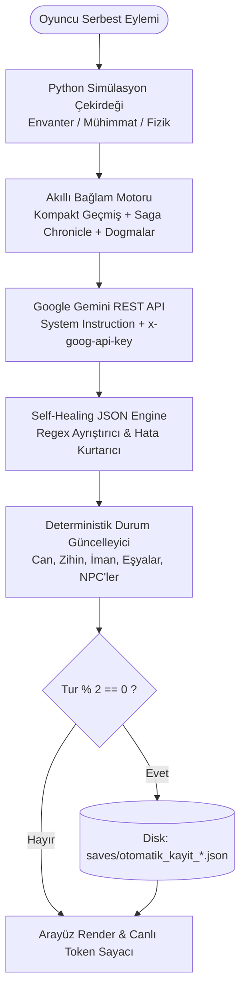

# 🌌 Chronicles of Gemini - AI Sandbox RPG & Cosmic Engine

[](https://www.python.org/)
[](https://flask.palletsprojects.com/)
[](https://ai.google.dev/)
[-brightgreen.svg?style=flat-square)](test_app.py)
[](#-token-tasarrufu-ve-api-kota-koruma-motoru-85---95-azalma)
[](LICENSE)

> **Chronicles of Gemini**, Google Gemini dil modellerinin gücünü deterministik Python simülasyon kuralları ve katı bir evren hakemiyle birleştiren, **%100 saf sandbox rol yapma (RPG) ve evren simülasyonu motorudur.**

Oyuncuya asla yapay şıklar (A, B, C seçenekleri) veya ucuz senaryo zırhı (plot armor) sunmaz. İster ölümcül bir kış kıyametinde donarak hayatta kalmaya çalışan bir izci olun, ister gökleri yarıp ölümlülerin dualarını yargılayan mutlak bir **Yüce Tanrı**; oyun motoru evrenin fiziksel kanunlarından ve tanımladığınız kırılmaz dogmalardan **asla taviz vermez**.

---

## 📑 İçindekiler

1. [Mimari Genel Bakış](#-mimari-genel-bak%C4%B1%C5%9F)
2. [Oyun Modları & Katılık Seviyeleri](#-oyun-modlar%C4%B1--kat%C4%B1l%C4%B1k-seviyeleri)
   - [🛡️ Gerçekçi Mod (Strict Realism)](#1-ger%C3%A7ek%C3%A7i-mod-strict-realism)
   - [✨ Fantezi Modu (Consistent Fantasy)](#2-fantezi-modu-consistent-fantasy)
   - [🌌 Tanrı Simülasyonu (God Sim Mode) & 10 İlahi Mekanik](#3--tanr%C4%B1-sim%C3%BClasyonu-god-sim-mode--10-%C4%B0lahi-mekanik)
   - [🔥 Deli Modu (Kabus Zorluğu) & Katılık Skalası](#4--deli-modu-kabus-zorlu%C4%9Fu--kat%C4%B1l%C4%B1k-skalas%C4%B1)
3. [Akıllı Bellek & Anlatı Derinliği](#-ak%C4%B1ll%C4%B1-bellek--anlat%C4%B1-derinli%C4%9Fi)
   - [Çift Katmanlı NPC Hafıza Mimarisi](#1-%C3%A7ift-katmanl%C4%B1-npc-haf%C4%B1za-mimarisi-active-vs-known-world)
   - [Destan Kronolojisi (Saga Chronicle)](#2-destan-kronolojisi-saga-chronicle)
   - [Çok Sesli İnsan Korosu & Mikro-İnsan Kamerası](#3-%C3%A7ok-sesli-%C4%B0nsan-korosu--mikro-%C4%B0nsan-kameras%C4%B1)
4. [⚡ Token Tasarrufu ve API Kota Koruma Motoru (%85 - %95 Azalma)](#-token-tasarrufu-ve-api-kota-koruma-motoru-85---95-azalma)
5. [💾 2 Turda Bir Otomatik Kayıt Motoru (Auto-Save)](#-2-turda-bir-otomatik-kay%C4%B1t-motoru-auto-save)
6. [✨ Yapay Zeka Evren & Karakter Mimarı](#-yapay-zeka-evren--karakter-mimar%C4%B1-serbest-konsept-modu)
7. [👑 Game Master (GM) & Hile Konsolu](#-game-master-gm--hile-konsolu)
8. [🚀 Kurulum ve Çalıştırma](#-kurulum-ve-%C3%A7al%C4%B1%C5%9Ft%C4%B1rma)
9. [📡 REST API Referansı](#-rest-api-referans%C4%B1)
10. [🧪 Otomatik Birim Testleri](#-otomatik-birim-testleri)
11. [🔒 Güvenlik & GitHub Uygunluğu](#-g%C3%BCvenlik--github-uygunlu%C4%9Fu)

---

## 🏛️ Mimari Genel Bakış

Sistem, yapay zekanın serbest metin üretimini deterministik bir kural motoruyla denetleyen hibrit bir boru hattı (pipeline) üzerinde çalışır:



---

## ⚔️ Oyun Modları & Katılık Seviyeleri

### 1. 🛡️ Gerçekçi Mod (Strict Realism)
* **Sıfır Senaryo Zırhı:** Karakter başkahraman olsa dahi hiçbir iltimas geçilmez. Kılıç eti keser, mermi kemiği parçalar, donma ve enfeksiyon öldürür.
* **Katı Envanter Bağımlılığı:** Üzerinizde olmayan hiçbir eşyayı kullanamazsınız (örneğin anahtarınız yoksa kapıyı açamaz, merminiz bittiyse silahı ateşleyemezsiniz).
* **Deterministik Mühimmat Tüketimi:** Ateşli silahlar kullanıldığında Python çekirdeği mühimmatı anında takip eder ve envanterden düşürür.

### 2. ✨ Fantezi Modu (Consistent Fantasy)
* Doğaüstü yetenekler, antik büyüler veya ileri teknoloji kullanılabilir; ancak **evrenin kendi bedel yasalarına** sıkı sıkıya uymak zorundadır. Bedelsiz güç kesinlikle yasaktır.

### 3. 🌌 Tanrı Simülasyonu (God Sim Mode) & 10 İlahi Mekanik
Oyuncunun sıradan bir ölümlü değil, **evrenin yaratıcısı ve mutlak Tanrısı** olduğu devrimsel simülasyon modu:

1. **Özelleştirilebilir Tanrı Dosyası:** Tanrı adı, kozmik varlık formu (Işık, Boşluk, Doğa), hüküm alanları (Savaş, Bereket, Kaos, Zaman vb.) ve kutsal emanetler.
2. **Kozmik İman, Korku ve Kudret Metrikleri:**
   - 🕊️ **İman (Faith %0-100):** Ölümlülerin sevgi ve adanmışlığı.
   - ⚡ **Korku (Fear %0-100):** Ölümlülerin ilahi gazap karşısındaki huşusu ve dehşeti.
   - 🔮 **İlahi Kudret (Divine Power %0-100):** Harcanan kozmik enerji.
3. **Canlı Ölümlü Duaları & Yakarılar Hub'ı:** Her turda fanilerden gelen 2-3 özgün yakarı ekranda listelenir; Tanrı tek tıkla karar verebilir:
   - `✨ Kabul Et` (Lütuf iner, İman artar)
   - `⚡ Gazap İndir` (Kibirli faniye yıldırım düşer, Korku artar)
   - `🌀 Kaderi Bük` (İronik / çarpık tecelli gerçekleşir)
   - `❌ Görmezden Gel` (İlahi sükut, kulun imtihanı)
4. **Kozmik Yasaları Yeniden Yazma (Divine Decrees):** Tanrı evrenin fizik yasalarını tek fermanla değiştirebilir (*"Ölüler ağaç olarak dirilsin"*, *"Yerçekimi tersine aksın"*).
5. **İlahi Tezahürler & Felaketler:** Tufanlar, göktaşı yağmurları, altın çağ bereketi veya yaratılış ışığı.
6. **Peygamberler ve Avatarlar:** Ölümlüler arasından elçiler atanır; kutsal öğretiler halklara tebliğ ettirilir.
7. **Dini Mezhepler ve Sapkınlıklar:** Tanrı'nın her hamlesi fanatik tarikatlar veya sapkın fırkalar doğurabilir.
8. **🏛️ Medeniyet Çağları ve Evrim Çarkı:**
   - *Yaratılış ve Kabileler* ➔ *Bronz ve Mabetler* ➔ *Demir ve Krallıklar* ➔ *Altın Felsefe ve Teokrasi* ➔ *Buhar ve Simya* ➔ *Kozmik Yıldız Çağı* ➔ *Kıyamet Sonrası*.
   - Çağlar interaktif modal üzerinden anında evriltilebilir.
9. **Kozmik Göksel Panel:** Altın/mor ilahi tema, dua bildirimleri ve peygamber listeleri.
10. **Kıyamet ve Büyük Patlama Protokolü:** Evreni sıfırlayıp baştan yeni ırklar yaratma iradesi.

### 4. 🔥 Deli Modu (Kabus Zorluğu) & Katılık Skalası
* 🔥 **Deli Modu:** Dil modeli ve oyun motoru her şeyi oyuncuyu ezmek için ayarlar. Düşmanlar pusu kurar, en ufak hata ölümcül sonuçlanır (-20/-45 Can, -15/-35 Zihin hasarı).
* 🔒 **Demir Kural (Ironclad):** Sıfır senaryo zırhı, tam kurallar.
* ⚔️ **Zorlayıcı (Challenging):** Yüksek risk ve gerçekçilik.
* ⚖️ **Dengeli (Balanced):** Dengeli edebi deneyim.

---

## 🧠 Akıllı Bellek & Anlatı Derinliği

### 1. Çift Katmanlı NPC Hafıza Mimarisi (Active vs Known World)
* **Aktif Sahne Listesi (`npc_relationships`):** Yalnızca o an bulunulan odadaki/mekandaki kişiler gösterilir. 3 tur boyunca görünmeyenler sol panelden otomatik temizlenerek arayüz kalabalığı önlenir.
* **Kalıcı Dünya Hafızası (`known_world_npcs`):** Karşılaşılan tüm önemli karakterler arka planda tutulur. Oyuncu 10 tur sonra bile eski bir ustanın veya müttefikin yanına döndüğünde, yapay zeka geçmiş anıları ve ilişkiyi anında hatırlar.

### 2. Destan Kronolojisi (Saga Chronicle)
* Oyunun ilk anından itibaren yaşanan kritik olaylar, alınan yaralanmalar ve ulaşılan mekanlar `GameState.generate_saga_chronicle()` tarafından özet bir zaman çizelgesine dönüştürülür ve her turda modelin bağlamına enjekte edilir.

### 3. Çok Sesli İnsan Korosu & Mikro-İnsan Kamerası
* **Roman Uzunluğu Şartı:** Her tur anlatımı **KESİNLİKLE EN AZ 4-6 DOLGUN PARAGRAFTAN (450-800 kelime)** oluşmak zorundadır. Yüzeysel özetler yasaklanmıştır.
* **Diyalog Formatı:** Konuşan her fani `[Karakter Adı]; "Diyalog metni..."` formatında konuşur.
* **Mikro-İnsan Kamerası:** İlahi kararlarda kamera sıradan köylülerin evlerine, ocak başlarına, beşiğindeki evladına sarılan annelere ve secde eden ihtiyarlara iner; kullarla derin duygusal bağ kurulur.

---

## ⚡ Token Tasarrufu ve API Kota Koruma Motoru (%85 - %95 Azalma)

Google AI Studio'nun 1.000.000 TPM (Token/Dakika) kotasını dakikalar içinde tüketen **"şişen geçmiş"** sorunu tamamen çözülmüştür:

| Tur | Eski Tüketim (Şişen Şablon) | Yeni Tüketim (Kompakt Mimari) | Tasarruf Oranı |
| :---: | :---: | :---: | :---: |
| **Tur 1** | ~6.000 token | **~2.400 token** | **%60 Azalma** |
| **Tur 10** | ~35.000 token | **~4.800 token** | **%86 Azalma** |
| **Tur 20** | ~90.000 token | **~5.500 token** | **%94 Azalma** |
| **Tur 50+** | ~250.000+ token | **~6.000 token** | **%97.5 Azalma** |

* **`get_compact_history`:** Geçmişe her turda 2.500 tokenlik kural kitapçıkları yerine yalnızca gerçek oyuncu eylemi (`Oyuncu Eylemi: "..."`) ve hikaye metni işlenir.
* **Pencereleme & Saga:** Son 5-6 turun konuşmaları akıcı tutulurken, eski olaylar `Saga Chronicle` üzerinden sıfır token israfıyla hatırlanır.
* **Güvenli Tavan (`max_tokens=8192`):** Aşırı kota rezervasyonu önlenir.
* **Canlı Token Sayacı:** Üst barda yer alan `⚡ Token Rozeti`, her hamlede harcanan toplam token miktarını (Prompt + Output) şeffafça gösterir.

---

## 💾 2 Turda Bir Otomatik Kayıt Motoru (Auto-Save)

* **Periyodik Güvenlik:** Her 2 tamamlanan turda (`turn_count > 0 and turn_count % 2 == 0`) oyun durumu sessizce ve güvenle diske kaydedilir (`saves/otomatik_kayit_{karakter_adi}.json`).
* **Tekil Slot Mimarisi:** Yüzlerce gereksiz dosya kirliliği oluşmaz; aktif karakterin tekil otomatik kayıt dosyası güncellenir.
* **Görsel Bildirim Toast'ı:** Tur bittiğinde üst barda neon yeşil `💾 Otomatik Kaydedildi (Tur #X)` rozeti belirir ve 3.5 saniye sonra yumuşakça kaybolur.
* **Kayıtlar Modalı:** Kayıtlı maceralar listesinde otomatik kayıtlar `🔄 Otomatik Kayıt` rozeti ve özel kenarlıkla listelenir.

---

## ✨ Yapay Zeka Evren & Karakter Mimarı (Serbest Konsept Modu)

* Kurulum ekranındaki **"✍️ Konsept Yaz"** kutucuğuna hayal ettiğiniz karakteri ve evreni serbest bir dille yazın (Örn: *"1888 vebalı Londra'sında akıl hastanesinden kaçmış eski bir saat ustasıyım. Büyü olmasın, karanlık olsun"*).
* Gemini API tek tıkla ad-soyad, kusurlar, travmalar, yetenekler, evren kuralları, sosyal yapı, kırılmaz dogmalar ve açılış sahnesini saniyeler içinde doldurur.

---

## 👑 Game Master (GM) & Hile Konsolu

Oyun ekranındaki **`👑 GM / Hile Paneli`** butonuyla istediğiniz an müdahale edebilirsiniz:
* **Can & Zihin Sağlığı:** Tek tıkla tam iyileşme (100 HP / 100 Mental) veya özel değer atama.
* **🛡️ Tanrı Modu (Ölümsüzlük):** Can ve akıl sağlığının azalmadığı dokunulmazlık modu.
* **🎒 Envanter Düzenleyici:** Doğrudan eşya ekleme ve mevcut eşyaları tek tıkla silme.
* **👥 NPC Tutum Değiştirici:** Karakterlerin oyuncuya yönelik tavrını belirleme veya silme.
* **🩹 Efekt Temizleyici:** Zehirlenme, kanama, hipotermi gibi tüm zararları temizleme.
* **🔮 Gizli GM Direktifi:** Yapay zekaya bir sonraki turda mutlaka uygulaması gereken gizli senaryo emirleri enjekte etme.

---

## ⚡ Hazır Şablonlar (Presets)

Kurulum ekranındaki açılır listeden tek tıkla yüklenebilir:
1. **Kıyamet Sonrası Sert Kış (Gerçekçi Hayatta Kalma):** Nükleer kış, dondurucu soğuk, açlık, mermi kısıtı, sıfır zombi/büyü.
2. **Kül Krallığı ve Kan Yemini (Karanlık Fantezi):** Kadim karanlık, can ve et bedeliyle çalışan kan büyüsü, fanatik Engizisyon.
3. **Neo-İstanbul 2099: Asit Yağmuru (Sert Siberpunk):** Dikey mega-kent, siber aşırı ısınma, mega şirket suikastçıları, asit yağmuru.
4. **Kozmik Tanrı Simülasyonu (Tanrı Modu):** Yaratılış, ölümlü yakarıları, ilahi fermanlar ve medeniyet evrimi.

---

## 🚀 Kurulum ve Çalıştırma

### Gereksinimler
* Python 3.9 veya üzeri
* Google Gemini API Anahtarı ([Google AI Studio'dan Ücretsiz Alın](https://aistudio.google.com/))

### 1. Yöntem: Tek Tıkla Başlatma (Windows)
Proje dizinindeki **`run.bat`** dosyasına çift tıklayın. Script gerekli paketleri otomatik kurar, sunucuyu açar ve tarayıcınızı `http://127.0.0.1:5000` adresinde başlatır.

### 2. Yöntem: Manuel Başlatma
```bash
# 1. Depoyu klonlayın
git clone https://github.com/KULLANICI_ADINIZ/story.git
cd story

# 2. Bağımlılıkları yükleyin
python -m pip install -r requirements.txt

# 3. (İsteğe Bağlı) API Anahtarınızı Ortam Değişkeni Olarak Atayın
set GEMINI_API_KEY=AIzaSy...

# 4. Sunucuyu başlatın
python app.py
```
Tarayıcınızdan `http://127.0.0.1:5000` adresine gidin. API anahtarınızı dilerseniz arayüzdeki kutucuğa yapıştırarak da hemen oynayabilirsiniz.

---

## 📡 REST API Referansı

| Uç Nokta | Metot | Açıklama |
| :--- | :---: | :--- |
| `/api/config` | `GET` | Ortam değişkeninde API anahtarı olup olmadığını döndürür. |
| `/api/presets` | `GET` | Hazır hızlı başlangıç evren şablonlarını listeler. |
| `/api/ai_create_concept` | `POST` | Serbest metinden tüm evren ve karakter alanlarını otomatik üretir. |
| `/api/start_game` | `POST` | 3 sekmedeki verileri derleyip giriş sahnesini (prologue) üretir. |
| `/api/take_action` | `POST` | Oyuncu eylemini hakem kurallarıyla işler, durumu günceller ve kaydeder. |
| `/api/save_game` | `POST` | Mevcut oyun durumunu manuel olarak JSON dosyasına kaydeder. |
| `/api/load_game` | `POST` | Belirtilen kayıt dosyasını yükler. |
| `/api/list_saves` | `GET` | Tüm kayıtlı oyunları ve otomatik kayıtları listeler. |
| `/api/auto_save` | `POST` | Çift turlu otomatik kayıt mekanizmasını doğrudan tetikler/test eder. |
| `/api/god/prayer_action` | `POST` | Tanrı Sim modunda duaya lütuf bahşetme, çarpma veya görmezden gelme. |
| `/api/god/set_era` | `POST` | Medeniyet çağını doğrudan ileri/geri sıçratma. |
| `/api/god/appoint_prophet`| `POST` | Ölümlüler alemine yeni bir peygamber/elçi atama. |
| `/api/gm/modify_stat` | `POST` | GM paneli üzerinden can ve akıl sağlığı düzenleme. |
| `/api/gm/toggle_godmode` | `POST` | GM ölümsüzlük modunu açma/kapatma. |
| `/api/gm/inject_directive`| `POST` | Evren hakemine gizli senaryo direktifi enjekte etme. |

---

## 🧪 Otomatik Birim Testleri

Proje, hiçbir API çağrısı yapmadan ve **sıfır token harcayarak** tüm oyun motorunu, kuralları, hakem mantığını ve API uç noktalarını **0.1 saniyede** test eden kapsamlı bir test paketine sahiptir:

```bash
python -m unittest test_app.py
```

```text
Ran 23 tests in 0.115s

OK
```

**Doğrulanan 23 Test Alanı:**
- Kural motoru ve katılık direktifleri (Realistic, Fantasy, Deli Modu)
- İstem inşaatçısı ve diyalog formatı doğrulaması
- Oyun durumu döngüsü, can/zihin sınırları (clamp 0-100)
- Çift katmanlı NPC hafızası ve sahneler arası yeniden hatırlama
- Destan kronolojisi (Saga Chronicle) oluşturulması
- Deterministik simülasyon ve mühimmat tüketim motoru
- Tanrı simülasyonu metrikleri, fermanlar, dualar, peygamberler ve çağlar
- 2 turda bir otomatik kaydetme motoru ve tekil slot yönetimi
- Kompakt geçmiş mimarisi ve token optimizasyon motoru

---

## 🔒 Güvenlik & GitHub Uygunluğu

Proje açık kaynak kod standartlarına ve en yüksek güvenlik kurallarına tam uyumludur:
* **Gömülü Anahtar Yok:** Kod tabanında hiçbir sabit API anahtarı veya gizli şifre bulunmaz.
* **Kişisel Kayıt İzolasyonu (`.gitignore`):** Kendi oynadığınız oyun kayıtları (`saves/*.json`) depoya eklenmez; sadece temiz şablon yapısı aktarılır.
* **Path Traversal Koruması:** Kayıt dosyası isimleri `os.path.basename` ve alfanumerik regex ile temizlenerek dizin dışı dosya erişimleri engellenir.
* **Header Tabanlı İletişim:** API anahtarları URL parametresi olarak değil, güvenli `x-goog-api-key` HTTP başlığı ile iletilir.

---

## 📄 Lisans

Bu proje [MIT Lisansı](LICENSE) altında sunulmaktadır. Dilediğiniz gibi geliştirebilir, çatallayabilir (fork) ve kendi evrenlerinizi yaratabilirsiniz.
